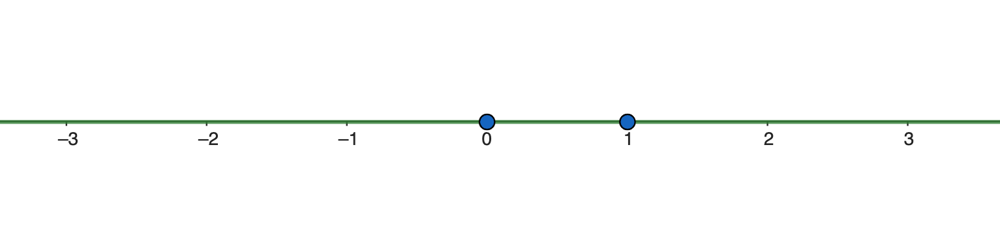
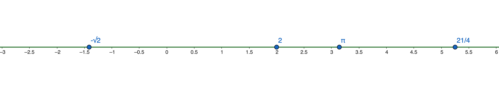

# La recta real: relació d'ordre

## Relació d'ordre i desigualtats

Donats dos nombres reals qualssevol, sempre en podem dir quin és més gran. Comencem per aquí:

!!! abstract "Definició: comparació de nombres reals"
    Donats dos nombres reals $a$ i $b$, direm que $a$ és més gran que $b$, i ho escriurem $a>b$, si i només si

    $$
    a > b \;\;\Leftrightarrow\;\; a-b > 0.
    $$

!!! note "Més gran o igual vs. més gran"
    Col·loquialment fem servir "més gran" tant per a $>$ com per a $\geq$, però matemàticament cal distingir-los:

    1. **més gran** $\Rightarrow$ *estrictament* més gran ($>$).
    2. **més gran o igual** $\Rightarrow$ inclou el cas d'igualtat ($\geq$).

Amb aquesta idea, ja podem definir totes les relacions d'ordre possibles:

!!! abstract "Definició: relacions d'ordre en els reals"
    Donats dos nombres reals $a$ i $b$:

    | Notació | Descripció i condició equivalent |
    |---|---|
    | $a=b$ | Igualtat: $a=b \Longleftrightarrow a-b=0$ |
    | $a \geq b$ | "$a$ és més gran o igual que $b$": $a \geq b \Longleftrightarrow a-b \geq 0$ |
    | $a \leq b$ | "$a$ és més petit o igual que $b$": $a \leq b \Longleftrightarrow a-b \leq 0$ |
    | $a > b$ | "$a$ és més gran que $b$": $a > b \Longleftrightarrow a-b > 0$ |
    | $a < b$ | "$a$ és més petit que $b$": $a < b \Longleftrightarrow a-b < 0$ |

!!! example "**Exemple:** Relacions d'ordre"
    Donats els nombres $-3$, $4$ i $6$:

    | Enunciat | Notació | Condició numèrica |
    |---|---|---|
    | $6$ és igual que $6$ | $6 = 6$ | $6-6=0$ és zero |
    | $4$ és més petit o igual que $6$ | $4 \leq 6$ | $4-6=-2$ és negatiu |
    | $4$ és més gran que $-3$ | $4 > -3$ | $4-(-3)=7$ és positiu |
    | $-3$ és més petit que $4$ | $-3 < 4$ | $-3-4=-7$ és negatiu |

Fixa't que aquestes cinc relacions cobreixen totes les possibilitats: dos nombres reals sempre acaben lligats per una d'elles, i això és el que ens permetrà situar-los tots sobre una recta.

## Representació gràfica

Per representar els nombres reals sobre una recta només ens calen dues referències: el $0$ i l'$1$, amb l'$1$ a la dreta del $0$. Aquesta distància marca la unitat i ens permet situar la resta d'enters, positius a la dreta i negatius a l'esquerra.

La regla és senzilla: com més gran és un nombre, més a la dreta el trobarem; com més petit, més a l'esquerra.

!!! note "Escala de la recta real"
    Recorda que en marcar el punt $1$ fixem l'escala de tota la recta: la distància de $0$ a $1$ determina la unitat i permet situar la resta de nombres.

!!! example "**Exemple:** Representació de punts a la recta real"
    Considerem els nombres reals $2$, $\pi$, $-\sqrt{2}$ i $\tfrac{21}{4}$. La seva representació decimal és:

    $$
    2 = 2{,}0, \qquad
    \pi = 3{,}141592\dots, \qquad
    -\sqrt{2} = -1{,}414213\dots, \qquad
    \tfrac{21}{4} = 5{,}25.
    $$

    $\pi$ i $-\sqrt{2}$ són irracionals, així que no tenen una representació decimal exacta. Tot i això, els podem situar igualment a la recta real:

    

!!! example "**Exemple:** Comparació entre fracció i decimal"
    Vegem que $\tfrac{2}{3} < 0{,}7$:

    $$
    \tfrac{2}{3} = 0{,}666\dots \quad < \quad 0{,}7.
    $$

Amb la recta real i la relació d'ordre a punt, ja tenim el que ens cal per definir els **intervals** i el **valor absolut**, que veurem a continuació.
