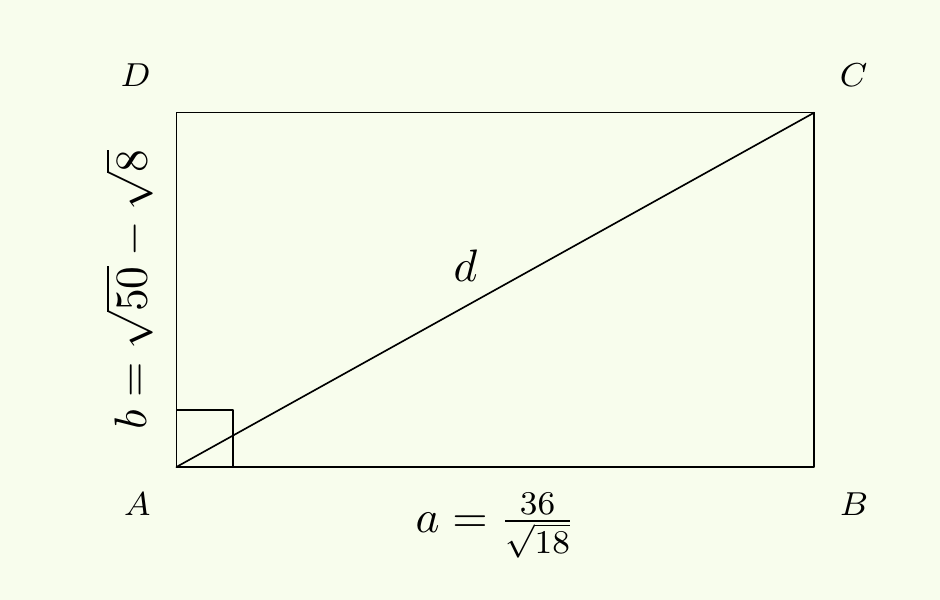

# Arrels i radicals

## Definició

Ja saps elevar un nombre a una potència. Ara ens plantegem la pregunta inversa: quin nombre, elevat a $n$, dona un resultat $a$ conegut? En forma d'equació: $x^n=a$, les solucions són exactament el concepte d'arrel.

!!! abstract "Definició: arrel enèsima"
    Siguin $a \in \mathbb{R}$ i $n \in \mathbb{N}$, amb $n>0$. Diem que $b$ és una **arrel enèsima** de $a$ si es compleix

    $$b^n = a.$$

    És a dir: un nombre real que, elevat a $n$, ens torna $a$.

!!! info "Notació: el símbol radical"
    Per representar una arrel fem servir el **radical**:

    $$\sqrt[n]{a},$$

    que, per convenció, indica sempre l'**arrel real principal** (la positiva, quan $n$ és parell i $a \geq 0$).

    Per exemple: $\sqrt{9}=3$ i $\sqrt[3]{-8}=-2$.

!!! note "Arrel vs. radical"
    Val la pena distingir-los bé:

    1. *arrel*: el resultat numèric (per exemple, $3$ és arrel quadrada de $9$).
    2. *radical*: el símbol $\sqrt[n]{a}$ amb què l'escrivim.

!!! example "Arrel quadrada"
    El radical $\sqrt{9}$ indica l'**arrel quadrada principal**: $\sqrt{9}=3$. En canvi, si plantegem l'equació $x^2=9$, hi ha dues solucions (arrels):

    $$x=\pm\sqrt{9} \;\Rightarrow\; x=\pm 3.$$

    Per això diem que $3$ i $-3$ són les *arrels de l'equació* $x^2-9=0$, mentre que el radical $\sqrt{9}$ denota únicament l'arrel principal positiva.

!!! example "Arrel cúbica"
    Busquem $b$ tal que $b^3=-8$. Només hi ha una solució real: $b=-2$. Quan $n$ és senar, l'arrel $n$-èsima real és sempre única.

!!! example "Nombres sense arrels reals"
    Vols trobar $b \in \mathbb{R}$ tal que $b^4=-16$? No existeix: per a qualsevol $b$ real, $b^4$ mai és negatiu. Per tant, **no hi ha cap arrel real quarta de $-16$**. Sempre que l'índex $n$ sigui parell i el radicand negatiu, el radical no està definit a $\mathbb{R}$.

!!! note "Arrels complexes"
    Que no hi hagi solucions reals no vol dir que no n'hi hagi cap: n'hi ha, però viuen fora de $\mathbb{R}$, en el conjunt dels *nombres complexos*. Per això és més precís dir "no té arrels **reals**".

    Els complexos afegeixen un element $i$ amb $i^2=-1$. Amb aquest conjunt, les quatre arrels quartes de $-16$ són

    $$
    a_1 = \sqrt{2} + \sqrt{2}i, \quad
    a_2 = \sqrt{2} - \sqrt{2}i, \quad
    a_3 = -\sqrt{2} + \sqrt{2}i, \quad
    a_4 = -\sqrt{2} - \sqrt{2}i.
    $$

Fixa't que, directament de la definició, se'n dedueix un fet senzill:

!!! tip "Propietat: definició equivalent d'arrel enèsima"
    Si $b = \sqrt[n]{a}$, aleshores

    $$\left(\sqrt[n]{a}\right)^n = b^n = a.$$

Això només és cert quan $\sqrt[n]{a}$ existeix com a nombre real, i això depèn de la paritat de $n$ i del signe d'$a$. Val la pena tenir-ho clar d'entrada:

!!! tip "Propietat: classificació segons l'índex i el radicand"
    | Radicand | Índex | Nombre d'arrels reals | Expressió radical |
    |---|---|---|---|
    | $a>0$ | Parell | 2 (dues) | $\pm \sqrt[n]{a}$ |
    | $a>0$ | Senar | 1 (única) | $\sqrt[n]{a}$ |
    | $a<0$ | Parell | Cap | — |
    | $a<0$ | Senar | 1 (única) | $\sqrt[n]{a} = -\sqrt[n]{\lvert a\rvert}$ |
    | $a=0$ | — | 1 (única) | $\sqrt[n]{0}=0$ |

## Relació amb les potències

Una arrel no és res més que una potència mirada del revés: $b$ és arrel $n$-èsima d'$a$ quan $b^n=a$.

$$
b^n=a
\quad \Longleftrightarrow \quad
b=\text{arrel $n$-èsima d'}a.
$$

Ens interessa poder-ho escriure com una potència d'exponent fraccionari. Si $b^n=a$, elevant tots dos costats a $\tfrac{1}{n}$:

$$\left(b^n\right)^{\tfrac{1}{n}} = a^{\tfrac{1}{n}} \quad \Rightarrow \quad b = a^{\tfrac{1}{n}}.$$

Fem servir el radical per representar aquest resultat, i arribem a la definició següent:

!!! abstract "Definició: expressió d'un radical com a potència"
    Siguin $m,n \in \mathbb{N}$ amb $n>0$. Definim

    $$a^{\tfrac{m}{n}} := \left(\sqrt[n]{a}\right)^m = \sqrt[n]{a^m}.$$

Aquesta equivalència és clau: ens permet passar d'arrels a potències (i a l'inrevés) sempre que convingui per simplificar o resoldre.

!!! example "Simplificació de radicals"
    Simplifiquem $\sqrt[4]{1024}$ passant-lo a potència:

    $$
    \sqrt[4]{1024}
    = \sqrt[4]{2^{10}}
    = 2^{\tfrac{10}{4}}
    = 2^{\tfrac{5}{2}}
    = \sqrt{2^{5}}
    = \sqrt{32}.
    $$

    I $\sqrt[3]{64}$:

    $$
    \sqrt[3]{64}
    = \sqrt[3]{4^{3}}
    = 4^{\tfrac{3}{3}}
    = 4.
    $$

## Propietats i exemples

Com que una arrel és una potència amb exponent fraccionari, hereta directament totes les propietats de les potències que ja coneixes. Només cal vigilar les condicions d'existència: la paritat de l'índex i el signe del radicand.

!!! tip "Propietat: simplificació i amplificació d'índex i exponent"
    $$
    \sqrt[np]{a^{mp}} \;=\; \sqrt[n]{a^{m}},
    \qquad n,p,m \in \mathbb{N},\; n\ge 2,\; p\ge 1.
    $$

    Val a $\mathbb{R}$ si:

    - $n$ senar: qualsevol $a \in \mathbb{R}$
    - $n$ parell i $m$ parell: qualsevol $a \in \mathbb{R}$
    - $n$ parell i $m$ senar: cal $a \ge 0$

!!! example "Simplificació d'una arrel"
    Recorda $\sqrt[4]{1024}=\sqrt[4]{2^{10}}$: podem cancel·lar un factor $2$ comú a índex i exponent directament:

    $$
    \sqrt[4]{1024}
    \;=\; \sqrt[2\cdot \cancel{2}]{2^{5\cdot \cancel{2}}}
    \;=\; \sqrt{2^5}
    \;=\; \sqrt{32}.
    $$

!!! note "Compte amb “cancel·lar $p$” sense restriccions"
    Com que $(-2)\cdot(-2)=4$, tenim $\sqrt[4]{(-2)^2}=\sqrt[4]{4}=\sqrt{2}$. Si "cancel·lem $p$" sense mirar les condicions:

    $$
    \sqrt[2 \cdot \cancel{2}]{(-2)^{1\cdot \cancel{2}}}
    =
    \sqrt[2]{(-2)^{1}}=\sqrt{-2},
    $$

    que no existeix a $\mathbb{R}$. Quan $n$ és parell i $m$ senar, cal exigir $a\ge 0$: sense aquesta condició, la igualtat no té sentit.

!!! example "Comparació de radicals"
    Quin és més gran, sense calculadora: $\sqrt{2}$ o $\sqrt[3]{3}$? Portem els dos exponents fraccionaris a un denominador comú (aquí, el $6$):

    $$\sqrt{2} = 2^{\tfrac{1}{2}} = 2^{\tfrac{3}{6}} = \sqrt[6]{2^3} = \sqrt[6]{8}
    \qquad\qquad
    \sqrt[3]{3} = 3^{\tfrac{1}{3}} = 3^{\tfrac{2}{6}} = \sqrt[6]{3^2} = \sqrt[6]{9}$$

    Amb el mateix índex, només cal comparar els radicands: com que $9>8$, tenim $\sqrt[3]{3} > \sqrt{2}$.

!!! tip "Propietat: producte d'arrels del mateix índex"
    $$
    \sqrt[n]{a}\cdot\sqrt[n]{b} \;=\; \sqrt[n]{\,a\cdot b\,},
    \qquad n\in\mathbb{N},\; n\ge 2
    $$

    Val per a tot $a,b\in\mathbb{R}$ si $n$ és senar; si $n$ és parell, cal $a\ge 0$ i $b\ge 0$. Es dedueix directament de la potència fraccionària:

    $$\sqrt[n]{a}\cdot\sqrt[n]{b} = a^{\tfrac{1}{n}} \cdot b^{\tfrac{1}{n}} = (a\cdot b)^{\tfrac{1}{n}} = \sqrt[n]{a\cdot b}.$$

!!! note "Compte amb $a\cdot b>0$ però $a,b<0$"
    $(-1)\cdot(-1)=1$, i $\sqrt{1}=1$. Però si apliquem la propietat directament, $\sqrt{-1}\cdot\sqrt{-1}$, i $\sqrt{-1}$ ja no existeix a $\mathbb{R}$. Per $n$ parell cal $a\ge 0$ i $b\ge 0$ per separat: que el producte $ab$ sigui positiu no n'hi ha prou.

!!! example "Extracció i introducció de factors"
    1. **Extreure factors d'un radical.** Separem l'exponent en un bloc múltiple de l'índex i un altre que no ho és:

        $$
        \sqrt[4]{1024} = \sqrt[4]{2^{10}}
        = \sqrt[4]{2^{8} \cdot 2^2}
        = \sqrt[4]{2^8} \cdot \sqrt[4]{2^{2}}
        = 2^{2} \cdot \sqrt{2}
        = 4 \sqrt{2}.
        $$

    2. **Introduir factors dins d'un radical.** Elevem el factor a l'índex abans de ficar-lo dins:

        $$
        x^2 \sqrt[3]{2}
        = \sqrt[3]{x^{2 \cdot 3}} \cdot \sqrt[3]{2}
        = \sqrt[3]{2x^6}.
        $$

!!! tip "Propietat: quocient d'arrels del mateix índex"
    $$
    \frac{\sqrt[n]{a}}{\sqrt[n]{b}}
    \;=\; \sqrt[n]{\tfrac{a}{b}},
    \qquad n \in \mathbb{N},\; n\ge 2
    $$

    Cert per a tot $a\in\mathbb{R}$, $b\neq 0$ si $n$ és senar; per a $a\ge 0$, $b>0$ si $n$ és parell.

!!! note "Compte amb radicands negatius"
    Amb $n=2$, $a=-4$ i $b=-1$: $\dfrac{\sqrt{-4}}{\sqrt{-1}}$ no existeix a l'esquerra (cap dels dos radicals hi és), mentre que a la dreta $\sqrt{\tfrac{-4}{-1}} = \sqrt{4} = 2$ sí. Per a $n$ parell, exigeix $a\ge 0$ i $b>0$ per separat.

!!! example "Simplificació de quocients d'arrels"
    1. $\sqrt{\tfrac{4}{9}} = \tfrac{\sqrt{4}}{\sqrt{9}} = \tfrac{2}{3}$
    2. $\dfrac{\sqrt[3]{-16}}{\sqrt[3]{2}} = \sqrt[3]{\tfrac{-16}{2}} = \sqrt[3]{-8} = -2$

    Aquesta propietat també és útil a l'inrevés: per convertir una fracció de radicals en un sol radical.

Quan els índexs són diferents, no podem aplicar directament el producte o el quocient. Primer cal amplificar les arrels a un índex comú —normalment el mínim comú múltiple (m.c.m.) dels índexs— i després operar.

!!! tip "Propietat: multiplicació i divisió d'arrels amb índex diferent"
    Per multiplicar o dividir $\sqrt[n]{a}$ i $\sqrt[m]{b}$: busca el m.c.m. $k$ de $n$ i $m$, amplifica les dues arrels a índex $k$, i aplica el producte o el quocient d'arrels del mateix índex.

!!! example "Multiplicació i divisió d'arrels amb índex diferent"
    Reaprofitem l'amplificació de l'exemple de comparació anterior: $\sqrt{2}=\sqrt[6]{8}$ i $\sqrt[3]{3}=\sqrt[6]{9}$. Amb el mateix índex, ja podem operar:

    $$\sqrt{2}\cdot\sqrt[3]{3} = \sqrt[6]{8}\cdot\sqrt[6]{9} = \sqrt[6]{72}
    \qquad\qquad
    \frac{\sqrt[3]{3}}{\sqrt{2}} = \frac{\sqrt[6]{9}}{\sqrt[6]{8}} = \sqrt[6]{\frac{9}{8}}$$

!!! tip "Propietat: arrel d'una arrel"
    $$
    \sqrt[n]{\sqrt[m]{a}} \;=\; \sqrt[n\cdot m]{a},
    \qquad n,m \in \mathbb{N},\; n,m \ge 2
    $$

    Val per a tot $a \in \mathbb{R}$ si $n$ i $m$ són senars; si algun dels dos és parell, cal $a \geq 0$.

!!! example "Arrel d'una arrel"
    Escrivim-ho com una sola arrel:

    $$\sqrt[3]{\sqrt[4]{x}} = \sqrt[3\cdot 4]{x} = \sqrt[12]{x}.$$

    Comprova-ho amb nombres: $\sqrt{\sqrt[4]{16}} = \sqrt{2}$, i també $\sqrt[2\cdot 4]{16} = \sqrt[8]{16} = \sqrt{2}$. Coincideixen.

!!! note "Compte amb restriccions en arrels imbricades"
    Amb $n=2$, $m=3$, $a=-1$: a l'esquerra, $\sqrt[3]{-1}=-1$ i, per tant, arribem a $\sqrt{-1}$, que no existeix a $\mathbb{R}$. A la dreta, $\sqrt[6]{-1}$ correspon a les sis arrels sisenes de $-1$ (a $\mathbb{C}$). No representen el mateix conjunt: cal escollir una branca concreta de l'arrel a $\mathbb{C}$ perquè la igualtat tingui sentit.

!!! tip "Propietat: potència d'una arrel"
    $$
    \left(\sqrt[n]{a}\right)^{m} \;=\; \sqrt[n]{\,a^{m}\,},
    \qquad n \in \mathbb{N},\; n\ge 2,\; m \in \mathbb{N}
    $$

    Cert per a tot $a\in\mathbb{R}$ si $n$ és senar; per a $a\ge 0$ si $n$ és parell.

!!! note "Paradoxa amb potència d'una arrel"
    Amb $n=2$, $m=2$, $a=-1$: $\sqrt{-1}$ no existeix a $\mathbb{R}$, però $\sqrt{(-1)^2}=\sqrt{1}=1$ sí. Estenent-ho a $\mathbb{C}$, $\sqrt{-1}=\pm i$, i en tots dos casos $(\pm i)^2=-1$: l'esquerra sempre val $-1$, la dreta $+1$. Per això, si $n$ és parell, cal exigir $a\ge 0$.

!!! example "Potència d'una arrel"
    1. Índex senar (admet radicand negatiu): $\left(\sqrt[3]{-2}\right)^{2} = \sqrt[3]{(-2)^{2}} = \sqrt[3]{4}$.
    2. Índex parell (cal $a\ge 0$): $\left(\sqrt{5}\right)^{3} = \sqrt{5^{3}} = \sqrt{125}$.

## Aplicacions de les propietats dels radicals

Vegem ara com combinar aquestes propietats per resoldre problemes habituals: treure les arrels d'un denominador i sumar radicals semblants.

!!! example "Racionalització de denominadors"
    Sovint interessa eliminar les arrels del denominador d'una fracció (per exemple, per poder-la sumar amb altres fraccions).

    1. $$
        \frac{3}{\sqrt{5}}
        = \frac{3}{\sqrt{5}} \cdot \frac{\sqrt{5}}{\sqrt{5}}
        = \frac{3\sqrt{5}}{5}.
        $$

    2. $$
        \begin{aligned}
        \frac{1}{2-\sqrt{3}} &= \frac{1}{2-\sqrt{3}} \cdot \frac{2+\sqrt{3}}{2+\sqrt{3}} \\
        &= \frac{2+\sqrt{3}}{2^2-\left(\sqrt{3}\right)^2} \\
        &= \frac{2+\sqrt{3}}{1} \\
        &= 2+\sqrt{3}.
        \end{aligned}
        $$

!!! note "Identitat notable per a la racionalització"
    Quan al denominador hi ha una suma o resta ($a\pm b$), multipliquem pel conjugat, aprofitant la identitat notable

    $$(a+b)(a-b) = a^2 - b^2.$$

    Si $a$ o $b$ són arrels, en elevar-les al quadrat es converteixen en nombres enters, i el denominador queda net de radicals.

!!! example "Suma i resta de radicals"
    Només podem sumar o restar radicals amb el mateix índex i el mateix radicand; sovint cal extreure factors primer perquè hi coincideixin:

    $$
    \begin{aligned}
    2\sqrt{2} + 5\sqrt{8} - 2\sqrt{18} + \sqrt{50}
    &= 2\sqrt{2} + 5\cdot 2\sqrt{2} - 2\cdot 3\sqrt{2} + 5\sqrt{2} \\
    &= (2+10-6+5)\sqrt{2} = 11\sqrt{2}.
    \end{aligned}
    $$

## Exemple final

!!! example "Diagonal i perímetre d'un rectangle"
    Considerem un rectangle de costats

    $$
    a = \frac{36}{\sqrt{18}}
    \qquad\text{i}\qquad
    b = \sqrt{50} - \sqrt{8},
    $$

    

    amb diagonal $d$. Resol sense calculadora:

    1. Simplifica $a$ i $b$.
    2. Calcula la diagonal $d$ del rectangle.
    3. Calcula el perímetre $P$ i escriu-lo de la forma més senzilla possible.

    **Solució**

    1. Simplificació de $a$ i $b$:

        $$
        \begin{aligned}
        a &= \frac{36}{\sqrt{18}} \cdot \frac{\sqrt{18}}{\sqrt{18}} = \frac{36\sqrt{18}}{18} \\
        &= 2\sqrt{18} = 2 \sqrt{3^2\cdot 2} = 6 \sqrt{2}
        \end{aligned}
        $$

        $$
        b=\sqrt{50}-\sqrt{8}
        =\sqrt{5^2\cdot 2}-\sqrt{2^2\cdot 2}
        =5\sqrt{2}-2\sqrt{2}
        =3\sqrt{2}.
        $$

    2. Diagonal (teorema de Pitàgores):

        $$
        \begin{aligned}
        d&=\sqrt{a^2+b^2} \\
        &=\sqrt{\left(6\sqrt{2}\right)^2+\left(3\sqrt{2}\right)^2} \\
        &=\sqrt{36\cdot 2 + 9\cdot 2} \\
        &=\sqrt{90}=\sqrt{9\cdot 10}=3\sqrt{10}.
        \end{aligned}
        $$

    3. Perímetre:

        $$P=2(a+b)=2\bigl(6\sqrt{2}+3\sqrt{2}\bigr) = 18\sqrt{2}.$$

!!! note "Teorema de Pitàgores"
    En un triangle rectangle, el quadrat de la hipotenusa és igual a la suma dels quadrats dels catets:

    $$c^2 = a^2 + b^2.$$

    Coneixent els catets $a$ i $b$, la hipotenusa s'obté amb $c = \sqrt{a^2+b^2}$. El radical $\sqrt{\phantom{a}}$ dona sempre l'arrel positiva, que és la que volem: la longitud del costat d'un triangle mai és negativa.

## Taula resum

| Propietat | Expressió |
|---|---|
| Definició d'arrel | $b=\sqrt[n]{a} \iff b^n=a$ |
| Arrel com a potència | $a^{\tfrac{m}{n}} = \sqrt[n]{a^m} = \left(\sqrt[n]{a}\right)^m$ |
| Existència ($n$ parell) | $a<0 \Rightarrow$ sense arrel real; $a\ge 0 \Rightarrow \pm\sqrt[n]{a}$ |
| Existència ($n$ senar) | sempre existeix, i és única: $\sqrt[n]{a}$ |
| Simplificació/amplificació | $\sqrt[np]{a^{mp}} = \sqrt[n]{a^{m}}$ |
| Producte, mateix índex | $\sqrt[n]{a}\cdot\sqrt[n]{b} = \sqrt[n]{ab}$ |
| Quocient, mateix índex | $\dfrac{\sqrt[n]{a}}{\sqrt[n]{b}} = \sqrt[n]{\tfrac{a}{b}}$ |
| Producte/quocient, índex diferent | amplifica primer a índex $k=\mathrm{mcm}(n,m)$ |
| Arrel d'una arrel | $\sqrt[n]{\sqrt[m]{a}} = \sqrt[n\cdot m]{a}$ |
| Potència d'una arrel | $\left(\sqrt[n]{a}\right)^m = \sqrt[n]{a^m}$ |
| Racionalització (monomi) | $\dfrac{c}{\sqrt{a}} = \dfrac{c\sqrt{a}}{a}$ |
| Racionalització (binomi, conjugat) | $\dfrac{1}{a-\sqrt{b}} = \dfrac{a+\sqrt{b}}{a^2-b}$ |
