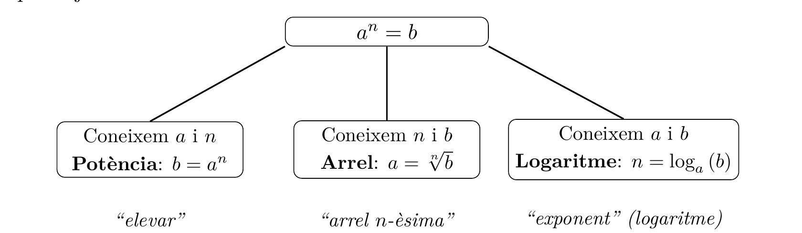

# Logaritmes

## Definició

Imagina que et demanen quin exponent cal aplicar a una base per obtenir un cert resultat: si $a^n = b$, quant val $n$? Aquest és exactament el problema que resolen els logaritmes.

!!! abstract "Definició: logaritme"
    Siguin $a$ i $b$ dos nombres reals amb $a>0$, $a \neq 1$ i $b>0$. El **logaritme en base $a$ de $b$** és el nombre real $n$ tal que

    $$
    \log_a b = n
    \quad \Leftrightarrow \quad
    a^n = b.
    $$

!!! note "Condicions de definició"
    Recorda: cal $a>0$, $a\neq 1$ i $b>0$.

    $\log_2 0$ no té sentit, perquè cap exponent $n$ fa $2^n=0$. Tampoc $\log_{-3} 9$: és cert que $(-3)^2=9$, però la funció $n \mapsto (-3)^n$ no està ben definida per a tot $n$ real (què seria $(-3)^{1/2}$?). Per això la base sempre ha de ser positiva.

!!! note "Una mica d'història"
    El terme *logaritme* prové del grec: *logos* (raó, proporció) i *arithmos* (nombre). El va encunyar **John Napier** (1550–1617), matemàtic escocès, al llibre *Mirifici Logarithmorum Canonis Descriptio* (1614). El seu objectiu: convertir multiplicacions i divisions en sumes i restes, molt més ràpides de calcular a mà.

Potències, arrels i logaritmes són, en el fons, la mateixa relació $a^n=b$ mirada des de tres angles diferents:

Per això, com veurem, les propietats dels logaritmes (i de les arrels) no fan res més que traduir les propietats que ja coneixem de les potències.

!!! example "**Exemple:** Triple equivalència amb nombres concrets"
    Fixa't en $2^3=8$: aquesta relació es pot escriure de tres maneres equivalents:

    $$
    2^3 = 8
    \quad \Leftrightarrow \quad
    \sqrt[3]{8}=2
    \quad \Leftrightarrow \quad
    \log_2 8=3.
    $$

### Casos especials de logaritmes

Hi ha dos casos que tenen nom i notació propis, perquè els fem servir constantment:

!!! note "El nombre $e$"
    El nombre $e \approx 2{,}718281828459045\ldots$ és una constant irracional amb un paper clau en matemàtiques: apareix de manera natural en límits, derivades i creixements continus. El nom *logaritme neperià* és, de fet, un homenatge al mateix Napier.

- **Logaritme decimal.** El logaritme en base $10$ s'escriu sense subíndex: $\log_{10} x = \log x$.
- **Logaritme neperià.** El logaritme en base $e$ s'escriu $\ln x$: $\log_e x = \ln x$.

## Propietats i exemples

Vegem ara, una a una, les propietats dels logaritmes. Totes surten directament de la definició i de les propietats que ja coneixem de les potències.

!!! tip "Propietat: logaritme de $1$"
    Eleva qualsevol base $a$ (amb $a>0$, $a\neq 1$) a l'exponent $0$ i sempre obtens $1$. Per això:

    $$\log_a 1=0.$$

    *Per què?* Perquè l'únic $n$ real que fa $a^{n}=1$, amb $a\neq 1$, és $n=0$.

!!! note "I per què no $\log_1 1$?"
    Buscar $\log_1 1$ voldria dir trobar un $n$ tal que $1^n=1$... però això és cert per a *qualsevol* $n$! No hi ha un exponent únic, i per això la base mai pot valer $1$.

!!! example "**Exemple**"
    $\log_2 1=0$, ja que $2^{0}=1$.

!!! tip "Propietat: logaritme de la base"
    Si la base i el número coincideixen, l'exponent que hi porta és sempre $1$:

    $$\log_a a = 1.$$

    *Per què?* Perquè $a^n=a$ només es compleix per a $n=1$.

!!! example "**Exemple**"
    $\log_2 2=1$, ja que $2^{1}=2$.

!!! tip "Propietat: logaritme del producte"
    El logaritme transforma productes en sumes — aquest és precisament el motiu pel qual Napier els va inventar! Per a $M,N>0$:

    $$\log_a (M \cdot N) \;=\; \log_a M + \log_a N.$$

    *Per què?* Si $\log_a M=m$ i $\log_a N=n$, aleshores $M \cdot N = a^m \cdot a^n = a^{m+n}$.

!!! example "**Exemple**"
    $$
    \log_2 6
    = \log_2 (2 \cdot 3)
    = \log_2 2 + \log_2 3
    = 1 + \log_2 3.
    $$

!!! tip "Propietat: logaritme del quocient"
    I, de manera semblant, els quocients es converteixen en restes. Per a $M,N>0$:

    $$\log_a \tfrac{M}{N} \;=\; \log_a M - \log_a N.$$

    *Per què?* Amb $M=a^m$ i $N=a^n$, tenim $\tfrac{M}{N}=a^{m-n}$.

!!! example "**Exemple**"
    $$
    \log_2 3
    = \log_2 \tfrac{6}{2}
    = \log_2 6 - \log_2 2
    = \log_2 6 - 1.
    $$

!!! tip "Propietat: logaritme d'una potència"
    L'exponent "baixa" i multiplica. Per a $M>0$ i qualsevol $n\in\mathbb{R}$:

    $$\log_a (M^n) \;=\; n \cdot \log_a M.$$

    *Per què?* Si $M=a^m$, aleshores $M^n=(a^m)^n=a^{n\cdot m}$.

!!! example "**Exemple**"
    Amb aquesta propietat, calcular $\log_2 32$ és immediat:

    $$
    \log_2 32 = \log_2 2^5 = 5 \cdot \log_2 2 = 5.
    $$

!!! tip "Propietat: logaritme d'una arrel"
    Una arrel $n$-èsima no és més que un exponent fraccionari, així que aquesta propietat és la germana de l'anterior. Per a $M>0$ i $n\in\mathbb{N}$, $n>0$:

    $$\log_a \sqrt[n]{M} \;=\; \tfrac{1}{n} \cdot \log_a M.$$

    *Per què?* Perquè $\sqrt[n]{M}=M^{1/n}$, i apliquem la propietat de la potència.

!!! example "**Exemple**"
    $$
    \log_2 \sqrt{8}
    = \tfrac{1}{2}\,\log_2 2^3
    = \tfrac{1}{2}\cdot 3
    = 1{,}5.
    $$

!!! tip "Propietat: canvi de base"
    A la calculadora només trobem $\log$ (base $10$) i $\ln$ (base $e$). Aquesta propietat ens deixa calcular un logaritme en *qualsevol* base a partir d'aquests. Amb $a,b,M>0$, $a\neq 1$, $b\neq 1$:

    $$\log_a M = \frac{\log_b M}{\log_b a}.$$

    *Per què?* Si $n=\log_a M$, aleshores $a^n=M$. Prenent $\log_b$ a banda i banda i aplicant la propietat de la potència, $n\cdot\log_b a=\log_b M$, d'on surt la fórmula.

!!! example "**Exemple**"
    $$
    \log_2 100 = \frac{\log 100}{\log 2} = \frac{2}{\log 2} = \frac{\ln 100}{\ln 2}.
    $$

## Taula resum

Per repassar d'un cop d'ull:

| Propietat | Fórmula |
| --- | --- |
| Logaritme de $1$ | $\log_a 1 = 0$ |
| Logaritme de la base | $\log_a a = 1$ |
| Producte | $\log_a (M\cdot N) = \log_a M + \log_a N$ |
| Quocient | $\log_a \dfrac{M}{N} = \log_a M - \log_a N$ |
| Potència | $\log_a (M^n) = n\log_a M$ |
| Arrel | $\log_a \sqrt[n]{M} = \dfrac{1}{n}\log_a M$ |
| Canvi de base | $\log_a M = \dfrac{\log_b M}{\log_b a}$ |
| Logaritme decimal | $\log_{10} x = \log x$ |
| Logaritme neperià | $\log_e x = \ln x$ |

## Exemples d'aplicació

Acabem amb dos exemples reals on els logaritmes apareixen de manera natural: l'interès compost i l'equació de Hill en farmacologia.

!!! example "**Exemple:** Interès compost"
    Quan un capital $C_0$ genera un interès compost del $i\%$ anual, al cap de $t$ anys tenim

    $$C_f = C_0 \left( 1 + \tfrac{i}{100}\right)^t.$$

    Suposem $C_0=7.000$ € a un $2{,}5\%$ anual. Quants anys calen, aproximadament, per arribar a $7.354$ €?

    $$
    7354 = 7000 \cdot 1{,}025^t
    \;\Rightarrow\;
    1{,}025^t = \frac{7354}{7000} \approx 1{,}050571.
    $$

    Apliquem la definició de logaritme i, per poder-lo calcular amb la calculadora, canviem a base neperiana:

    $$
    t = \log_{1{,}025} 1{,}050571
    = \frac{\ln 1{,}050571}{\ln 1{,}025}
    \approx \frac{0{,}049316}{0{,}024692}
    \approx 1{,}998.
    $$

    És a dir, uns **$2$ anys**.

!!! example "**Exemple:** Equació de Hill"
    En farmacologia, l'**equació de Hill** relaciona la concentració d'un fàrmac amb la resposta biològica que provoca:

    $$E = E_{max} \cdot \frac{D^n}{K_D^n+D^n},$$

    on $E_{max}$ és l'efecte màxim, $K_D$ la concentració que dona la meitat de l'efecte màxim, i $n$ (el coeficient de Hill) el que volem trobar.

    Dades: $E_{max}=90\%$, $K_D=60$, i $E=80\%$ per a $D=90$. Substituint i simplificant:

    $$
    80 = 90 \cdot \frac{90^n}{60^n+90^n}
    \;\Rightarrow\;
    8\cdot 60^n = 90^n
    \;\Rightarrow\;
    \Bigl(\tfrac{3}{2}\Bigr)^n = 8
    $$

    (dividint tot entre $60^n$ i simplificant $\tfrac{90}{60}=\tfrac32$).

    Ara ja és una definició de logaritme directa, amb canvi de base:

    $$
    n = \log_{3/2} 8
    = \frac{\ln 8}{\ln \frac{3}{2}}
    \;\simeq\; 5{,}13.
    $$
