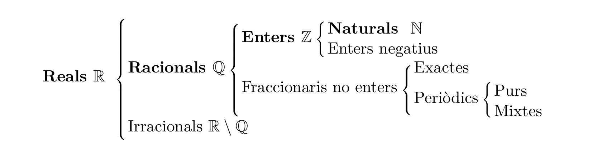

# El conjunt dels nombres reals

Segur que ja coneixes molts conjunts de nombres dels cursos anteriors. Repassem-los ara amb una mica més de rigor, per veure com s'encaixen els uns dins dels altres.

Comencem pel conjunt més senzill: els **nombres naturals**, els que fem servir per comptar els elements d'un conjunt finit:

$$
\mathbb{N} = \{0, 1, 2, 3, 4, \dots\}
$$

!!! note "Notació: conjunts finits i infinits numerables"
    Un conjunt finit o infinit numerable s'escriu entre claus, amb els elements separats per comes: $\{e_1, e_2, e_3, \dots\}$. Quan el conjunt és infinit, els punts suspensius ($\dots$) indiquen que el patró continua indefinidament sense acabar-se mai.

Fixa't que el $0$ és l'element neutre de la suma i l'$1$ ho és del producte: sumar-hi $0$ o multiplicar-hi per $1$ no altera el nombre original. Per exemple, amb el $4$:

$$
4 + 0 = 0 + 4 = 4 \qquad\qquad 4 \cdot 1 = 1 \cdot 4 = 4
$$

Ara bé, què passa si volem restar dos naturals com $3-8$? Ens cal ampliar el conjunt. Definim el **nombre oposat** d'un nombre com aquell que, sumat a l'original, dona $0$; el notem amb un $-$ al davant:

$$
5 + (-5) = 0
$$

Amb això, la resta no és més que sumar l'oposat. Tornem, doncs, al $3-8$ que ens havia quedat pendent:

$$
3 - 8 = 3 + (-8) = -5
$$

Si afegim als naturals tots els seus oposats, obtenim els **nombres enters**:

$$
\mathbb{Z} = \{\dots, -3, -2, -1, 0, 1, 2, 3, \dots\}
$$

Tot nombre, a més, es pot escriure en forma decimal: part entera i part decimal separades per una coma. Per exemple:

$$
-6 = -6{,}0 \qquad 1{,}56 \qquad 1{,}\overline{3} \qquad \pi = 3{,}141592\dots
$$

Aquesta representació decimal ens permet separar els nombres en dos grans grups: els **racionals** ($\mathbb{Q}$), que es poden escriure com una fracció, i els **irracionals** ($\mathbb{R}\setminus\mathbb{Q}$), que no:

$$
x \in \mathbb{Q} \;\;\Leftrightarrow\;\; \exists\, m,n \in \mathbb{Z},\; n \neq 0 \;\; \text{tals que } x=\frac{m}{n}
$$

!!! note "Pertinença"
    Quan un element pertany a un conjunt fem servir el símbol $\in$; si no hi pertany, $\notin$.

    Exemple: $-3 \in \mathbb{Z}$, però $-3 \notin \mathbb{N}$.

!!! note "Implica i equival"
    $\Rightarrow$ es llegeix "aleshores" (implica). $\Leftrightarrow$ es llegeix "equival" (si i només si).

    Exemple: $x \in \mathbb{N} \Rightarrow x \in \mathbb{Z}$ — si $x$ és natural, també és enter.

Dins dels racionals no enters, en trobem de dos tipus: els **exactes** (part decimal amb un nombre finit de xifres) i els **periòdics** (la part decimal es repeteix indefinidament seguint un patró, pur o mixt).

!!! note "Quantificadors"
    $\forall$ es llegeix "per a tot". $\exists$ es llegeix "existeix" o "hi ha".

    Exemple: $\forall n \in \mathbb{N},\; n+1 \in \mathbb{N}$ — per a tot natural $n$, $n+1$ també ho és.

Aquest esquema resumeix tota la divisió que acabem de fer:

Com veus, cada conjunt queda contingut dins del següent:

$$
\mathbb{N} \subset \mathbb{Z} \subset \mathbb{Q} \subset \mathbb{R}
$$

!!! note "Inclusió"
    Si $A \subset B$, tots els elements d'$A$ són també d'$B$.

    Exemple: $\mathbb{N} \subset \mathbb{Z}$.
