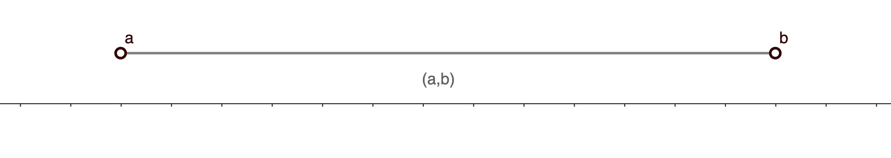
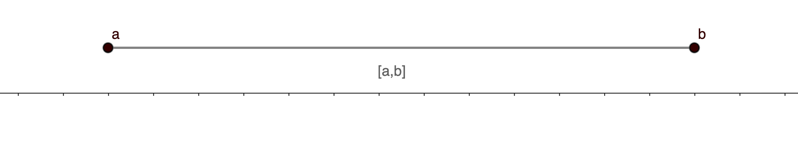
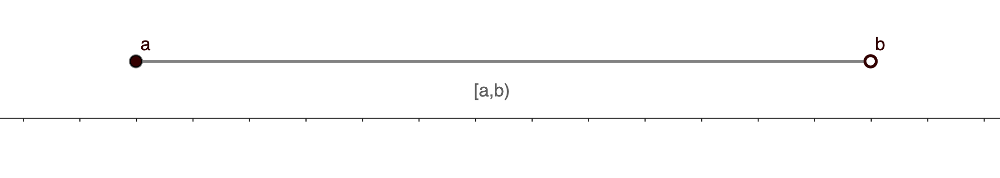
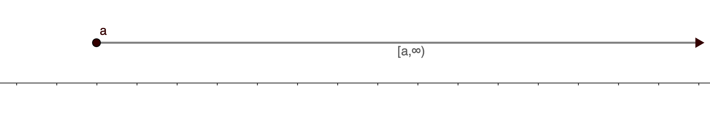
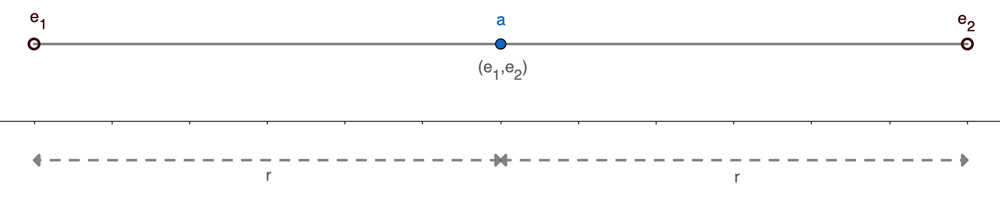
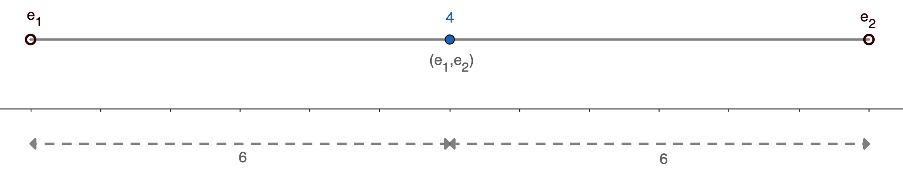

# Intervals i valor absolut

A [La recta real](recta-real.md) hem vist la relació d'ordre entre nombres reals. Ara la utilitzarem per definir dos conceptes que farem servir més endavant: els **intervals** i el **valor absolut**.

## Intervals

Segur que ja coneixes els intervals de cursos anteriors: són conjunts de nombres que compleixen una condició d'ordre respecte a un o dos valors donats. Repassem-ho.

!!! abstract "Definició: interval obert i interval tancat"
    Donats dos nombres reals $a$ i $b$ amb $a<b$, es defineix un **interval obert** com

    $$(a,b) = \{x\in \mathbb{R}, a<x<b\}$$

    i un **interval tancat** com

    $$[a,b] = \{x \in \mathbb{R}, a \leq x \leq b\}$$

    Sobre la recta real es representen així:

    

    

Però un interval no cal que sigui obert o tancat pels dos costats alhora. Si un extrem és obert i l'altre tancat, parlem d'un **interval semiobert** (o semitancat). Si un dels extrems és infinit, en diem **semirecta**:

Fixa't en aquesta taula: t'hi pots referir sempre que dubtis de com s'escriu cada tipus d'interval.

!!! tip "Propietat: classificació dels intervals"
    | Notació | Nom | Condició |
    |---|---|---|
    | $(a,b)$ | Obert | $a < x < b$ |
    | $[a,b]$ | Tancat | $a \leq x \leq b$ |
    | $(a,b]$ | Semiobert a l'esquerra | $a < x \leq b$ |
    | $[a,b)$ | Semiobert a la dreta | $a \leq x < b$ |
    | $(a,+\infty)$ | Semirecta oberta | $x > a$ |
    | $[a,+\infty)$ | Semirecta tancada | $x \geq a$ |
    | $(-\infty,b)$ | Semirecta oberta | $x < b$ |
    | $(-\infty,b]$ | Semirecta tancada | $x \leq b$ |

## Valor absolut

Quan et cal treballar amb una quantitat sempre positiva, encara que el nombre de partida no ho sigui, entra en joc el **valor absolut**:

!!! abstract "Definició: valor absolut"
    Donat un nombre real $a$, es defineix el seu valor absolut com

    $$
    |a| = \begin{cases} a & \text{ si } a \geq 0 \\ -a & \text{ si } a <0 \end{cases}
    $$

!!! example "Càlcul d'alguns valors absoluts"
    $$
    |3| = |+3| = 3 \qquad\qquad |-5| = -(-5) = 5
    $$

Dit d'una altra manera: si el nombre ja és positiu, el deixem igual; si és negatiu, li canviem el signe.

Aquesta idea té una aplicació immediata: mesurar distàncies. Sobre la recta real, la distància entre dos punts $a$ i $b$ és $b-a$ si $a<b$, o $a-b$ si $a>b$. Fixa't que les dues expressions són oposades:

!!! example "Càlcul d'algunes distàncies"
    Siguin $a=3$ i $b=7$. Aleshores

    $$
    a-b = 3-7 = -4 \qquad\qquad b-a = 7-3 = 4
    $$

Com que una distància mai és negativa, ens n'hi ha prou amb prendre el valor absolut d'una de les dues expressions, sense preocupar-nos de quin nombre és més gran:

!!! abstract "Definició: distància entre dos nombres reals"
    Siguin $a$ i $b$ dos nombres reals qualssevol. Es defineix la distància entre $a$ i $b$ com

    $$d(a,b) = |b-a|$$

Amb aquesta eina ens podem preguntar: quins nombres $x$ estan a una distància menor que un cert $r$ d'un nombre $a$? És a dir, quins $x$ compleixen

$$d(a,x)<r$$

Gràficament, es tracta de trobar els extrems d'un interval $(e_1,e_2)$:

!!! example "Reals a una distància menor que un valor conegut d'un altre real"
    Sigui $a=4$ i $r=6$. Volem els punts la distància dels quals a $a$ sigui menor que $r$:

    $$d(x,4)<6 \qquad\Rightarrow\qquad |x-4|<6$$

    Gràficament, busquem els extrems del següent interval:

    

    Observem que $e_1=4-6=-2$ i $e_2=4+6=10$. Per tant, l'interval demanat és $(-2,10)$.

Aquest resultat es generalitza sempre igual, per a qualsevol punt i qualsevol distància:

!!! tip "Propietat: entorn d'un punt"
    Per a qualsevol $a \in \mathbb{R}$ i $r>0$ es té

    $$
    |x-a| < r \quad \Longleftrightarrow \quad a-r < x < a+r,
    $$

    és a dir, l'interval solució és sempre $(a-r,\,a+r)$.

## Inequacions lineals

Una inequació lineal és una desigualtat amb una incògnita on les expressions implicades són polinomis de grau $1$. Ja les vas resoldre en cursos anteriors i el mètode és pràcticament el mateix que amb les equacions de primer grau... amb una diferència important que cal vigilar.

!!! example "Resolució d'una inequació lineal"
    $$2x-5>7$$

    Aïllem la $x$ igual que amb les equacions de primer grau:

    $$2x > 7 + 5 \qquad\Rightarrow\qquad 2x > 12 \qquad\Rightarrow\qquad x > \frac{12}{2} = 6$$

    Per tant, la solució és la semirecta $(6,+\infty)$.

!!! note "Atenció amb el signe!"
    Quan multipliques o divideixes una desigualtat per un nombre negatiu, cal **canviar el sentit de la desigualtat**.

    Per exemple: $2 < 5 \quad \Longrightarrow \quad -2 > -5$

!!! example "Resolució d'una altra inequació lineal"
    $$-3x + 5 \leq 23$$

    $$-3x \leq 23 - 5 \qquad\Rightarrow\qquad -3x \leq 18$$

    El valor que passem dividint és negatiu: girem el sentit de la desigualtat (només cal fer-ho amb el producte i la divisió):

    $$x \geq \frac{18}{-3} = -6$$

    Per tant, la solució és la semirecta $[-6,+\infty)$.
